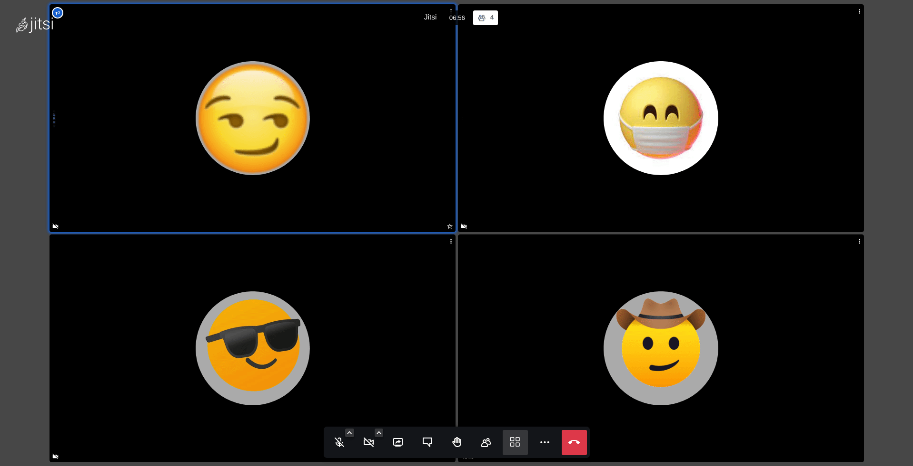

# Jitsi-activeSpeaker
[This project](https://platform-euhack21.bemyapp.com/#/projects/6082d2112f90ac001965e417) started developing on April 26th at [Winning over the classroom with Jitsi](https://euhack21.bemyapp.com/) Hackathon.
We've made improvements to find the activeSpeaker and make it stand out in crowded meetings.

## Active Speaker's Priority

Updated on [Filmstrip](https://github.com/bayraktarulku/jitsi-projects/blob/main/activeSpeaker/jitsi-meet/react/features/filmstrip/components/web/Filmstrip.js) file.

Assign initial value created for the dominantSpeaker.
The dominant participant is searched for among remote participants, and if there is an active speaker, it is assigned to this variable.
```
let dominantSpeaker = null;
dominantSpeaker = remoteParticipants.filter( p => p.dominantSpeaker === true && p !== localParticipant)[0];
```

* Order the TileView

    If tileView is active and there is a dominant speaker, first create the dominant speaker then list the non-dominant remote participants.

    

* Order the Filmstrip

    If TileView is passive and there is a dominant speaker, create the dominant speaker after list the non-dominant remote participants.

    

```
// if tileView is active
{
    tileViewActive && dominantSpeaker ?
    <Thumbnail
        key = { `remote_${dominantSpeaker.id}` }
        participantID = { dominantSpeaker.id } /> : null
}
{
    remoteParticipants.map(
        p => (
            !p.dominantSpeaker ?
            <Thumbnail
                key = { `remote_${p.id}` }
                participantID = { p.id } /> : null
        ))
}
// if tileView is passive
{
    !tileViewActive && dominantSpeaker ?
    <Thumbnail
        key = { `remote_${dominantSpeaker.id}` }
        participantID = { dominantSpeaker.id } /> : null
}
```

## Participant Search


Updated on [MeetingParticipantList.js](https://github.com/bayraktarulku/jitsi-projects/blob/main/activeSpeaker/jitsi-meet/react/features/participants-pane/components/MeetingParticipantList.js) file.

useState. It's a function exposed by react itself
useEffect: The component becomes a function and fetch gets called inside
React hooks: useState and useEffect; you'll import it in your components as:

```
import React, { useCallback, useRef, useState , useEffect} from 'react';
```

We define our value that will run when the component is first loaded as `[]`.
userState initial value -> useState([])
It won't be active the next time the code runs.
** Normally variables disappear when the function completes. But useState()
   keeps variables global, so it doesn't disappear.
useState () uses two values.
    - variable name (filteredParticipants)
    - function that will update the variable (setFilteredParticipants).
```
const [filteredParticipants, setFilteredParticipants] = useState([]);
const [search, setSearch] = useState('');
```

useEffect: Called again in every render. setFilteredParticipants refresh when search text changes
```
useEffect(() => {
  setFilteredParticipants(
    participants.filter((participant) =>
      participant.name.toLowerCase().includes(search.toLowerCase())
    )
  );
}, [search, participants]);
```


```
<FieldTextStateless
    autoFocus = { true }
    id = 'searchParticipant'
    onChange={(e) => setSearch(e.target.value)}
    placeholder = { 'Search Participant' }
    shouldFitContainer = { true }
    type = 'text'/>
<div>
    {filteredParticipants.map((p) => (
        <MeetingParticipantItem
            isHighlighted = { raiseContext.participant === p }
            key = { p.id }
            onContextMenu = { toggleMenu(p) }
            onLeave = { lowerMenu }
            participant = { p } /> : null
    ))}
</div>
```
